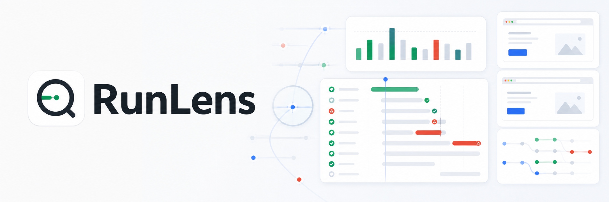
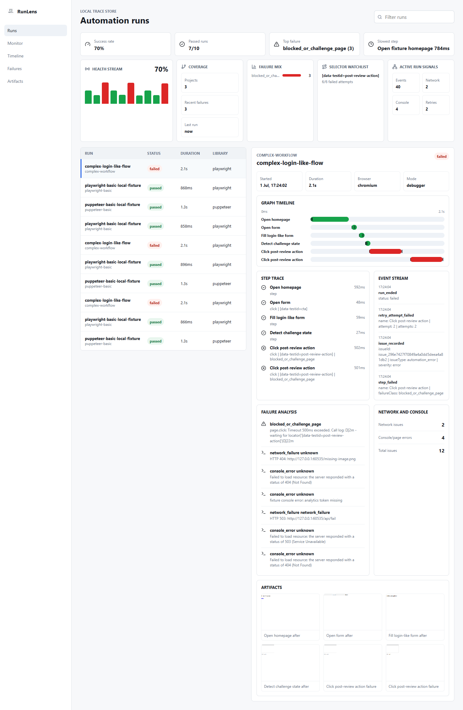
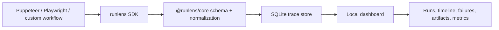

# RunLens

Local-first observability for browser automation reliability: runs, steps, selectors, screenshots, console errors, failed requests, retries, page context, and failure classification for Puppeteer, Playwright, and custom workflows.





## Install

From npm after release:

```bash
pnpm add runlens
```

From this repository today:

```bash
pnpm --filter runlens build
pnpm --filter runlens pack --pack-destination ../../dist-packages
pnpm add ../runlens/dist-packages/runlens-0.0.0.tgz
```

## 30-second quickstart

```ts
import { createRunLens } from "runlens";
import { instrumentPlaywrightPage } from "runlens/adapters/playwright";

const trace = createRunLens({
  project: "lead-gen",
  mode: "silent",
  storage: { type: "sqlite", path: ".runlens/runlens.db" }
});

const run = await trace.startRun({ name: "lead-extraction-flow" });
instrumentPlaywrightPage(page, run);

try {
  await run.step("Open homepage", async () => {
    await page.goto("https://example.com");
  });

  await run.step(
    "Click CTA",
    async () => {
      await page.click("[data-testid=cta]");
    },
    { selector: "[data-testid=cta]", action: "click" }
  );

  await run.end();
} catch (error) {
  await run.end("failed");
  throw error;
} finally {
  await trace.close();
}
```

## Puppeteer

```ts
import puppeteer from "puppeteer";
import { createRunLens } from "runlens";
import { instrumentPuppeteerPage } from "runlens/adapters/puppeteer";

const browser = await puppeteer.launch();
const page = await browser.newPage();
const trace = createRunLens({
  project: "puppeteer-app",
  mode: "debugger",
  storage: { type: "sqlite", path: ".runlens/runlens.db" }
});

const run = await trace.startRun({ name: "checkout-healthcheck" });
instrumentPuppeteerPage(page, run);
```

## Playwright

```ts
import { chromium } from "playwright";
import { createRunLens } from "runlens";
import { instrumentPlaywrightPage } from "runlens/adapters/playwright";

const browser = await chromium.launch();
const page = await browser.newPage();
const trace = createRunLens({
  project: "playwright-app",
  mode: "debugger",
  storage: { type: "sqlite", path: ".runlens/runlens.db" }
});

const run = await trace.startRun({ name: "session-refresh" });
instrumentPlaywrightPage(page, run);
```

## Dashboard

```bash
pnpm dev:dashboard
```

By default the dashboard reads `lab/test-runs/runlens.db`. Override it with:

```bash
RUNLENS_DB=.runlens/runlens.db pnpm dev:dashboard
```

## CLI

```bash
runlens doctor --db .runlens/runlens.db
runlens list --db .runlens/runlens.db
runlens inspect --db .runlens/runlens.db
runlens export --db .runlens/runlens.db --out runlens-export.json
```

## What RunLens Captures

- Run and step start/end/status/duration.
- Errors, stack traces, retry attempts, manual marks, and custom events.
- Page URL/title at failure.
- Console errors, page errors, failed requests, and HTTP 4xx/5xx responses.
- Failure screenshots in silent mode.
- Per-step screenshots and DOM snapshots in debugger mode.
- Tags, metadata, runtime/library/browser environment, selectors, and actions.

## Modes

- `silent`: passive, low-overhead tracing for existing workflows.
- `debugger`: richer local traces with screenshots, DOM snapshots, and timeline detail.

## Failure Classes

RunLens starts with rule-based classification:

- `selector_missing`
- `navigation_timeout`
- `network_failure`
- `blocked_or_challenge_page`
- `auth/session_expired`
- `validation_error`
- `unknown`

AI-assisted classification is intentionally left as a later provider interface; the observability foundation comes first.

## Safety Boundary

RunLens observes automation behavior. It does not bypass captcha, anti-bot systems, fingerprinting checks, stealth protections, or manual-review gates. It may label possible challenge states so developers can debug workflows responsibly.

## Architecture



## Repository Layout

- `packages/sdk`: public npm SDK package (`runlens`).
- `packages/core`: shared trace schema, event normalization, classification, metrics, and storage contracts.
- `apps/dashboard`: local dashboard for inspecting stored traces.
- `examples/puppeteer-basic`: real Puppeteer example.
- `examples/playwright-basic`: real Playwright example.
- `examples/complex-workflow`: retries, manual-review marker, and intentional failure.
- `lab/fixtures`: harmless local pages for browser automation tests.
- `lab/test-runs`: generated traces, screenshots and logs.
- `docs`: usage, API, architecture, and design notes.
- `scripts`: development, smoke, seed, and cleanup helpers.

## Documentation

- [Getting started](docs/getting-started.md)
- [SDK API](docs/api.md)
- [CLI](docs/cli.md)
- [Dashboard](docs/dashboard.md)
- [Clean examples](docs/examples.md)
- [Use cases](USECASES.md)
- [Architecture](docs/architecture.md)
- [Contributing](CONTRIBUTING.md)
- [Security](SECURITY.md)

## Local Development

```bash
pnpm install
pnpm build
pnpm typecheck
pnpm test
pnpm test:puppeteer
pnpm test:playwright
pnpm test:complex
pnpm test:cli
pnpm dev:dashboard
pnpm test:dashboard
```

Generated traces and screenshots are written under `lab/test-runs`.

## Roadmap

- [x] Monorepo scaffold with separate SDK, core, dashboard, examples, fixtures, docs, and CI.
- [x] Passive SDK run/step lifecycle with events, marks, retries, screenshots, and artifacts.
- [x] Puppeteer and Playwright page adapters.
- [x] SQLite local trace store and dashboard API.
- [x] Dashboard runs list, run detail, issue summaries, artifacts, reliability metrics, and graph timeline.
- [x] Real Puppeteer, Playwright, and complex expected-failure examples.
- [ ] Browser/context-level adapters for Playwright contexts, Puppeteer browsers, `playwright-extra`, and `puppeteer-real-browser`.
- [ ] CI reporter mode for attaching trace bundles to GitHub Actions runs.
- [ ] Exportable `.runlens` trace bundles for bug reports.
- [ ] Selector health analytics with flake score, first-seen/last-seen, and suggested owners.
- [ ] Production local dashboard server wrapper for packaged installs.
- [ ] Optional AI classification provider interface behind explicit user configuration.

## Developer Preview Waitlist

RunLens is built for teams with real browser automation pain: flaky selectors, blocked states, session churn, network instability, and browser-agent debugging.

To join the preview waitlist, open a GitHub issue using the `Developer Preview Waitlist` template and include:

- Browser stack: Puppeteer, Playwright, stealth plugins, browser agents, or custom tooling.
- Approximate run volume per day.
- Top failure modes you need to understand.
- Whether you want local-only traces, CI artifacts, or team dashboards first.
