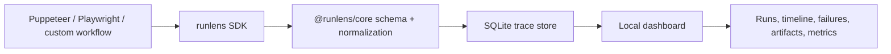

# RunLens

RunLens is local-first observability for browser automation: traces, failures, screenshots, network issues, console errors, and reliability metrics for Puppeteer, Playwright, and custom browser workflows.

> Status: initial production scaffold. The public SDK, adapters, SQLite storage, dashboard, and examples are being built in milestone-sized commits.

## Install

```bash
pnpm add runlens
```

## 30-second quickstart

```ts
import { createRunLens } from "runlens";

const trace = createRunLens({
  project: "example",
  mode: "silent",
  storage: { type: "sqlite", path: ".runlens/runlens.db" }
});

const run = await trace.startRun({ name: "lead-extraction-flow" });

await run.step("Open homepage", async () => {
  await page.goto("https://example.com");
});

await run.step("Click CTA", async () => {
  await page.click("[data-testid=cta]");
});

await run.end();
```

## Why it exists

Browser automations fail in ways that are hard to reconstruct: a selector moved, a navigation timed out, a login session expired, a challenge page appeared, a request failed, or the page emitted an error before the test code noticed. RunLens gives those failures a timeline and a local dashboard without changing automation behavior.

RunLens observes automation. It does not bypass captcha, anti-bot systems, fingerprinting checks, or stealth protections. It can label possible challenge/manual-review states so developers can debug workflows responsibly.

## Supported modes

- `silent`: minimal overhead event capture for existing workflows.
- `debugger`: richer local traces with screenshots, DOM snapshots, and timeline detail.

## Architecture



## Repository layout

- `packages/sdk`: public npm SDK package (`runlens`).
- `packages/core`: shared trace schema, event normalization, classification, and storage interfaces.
- `apps/dashboard`: local dashboard for inspecting stored traces.
- `examples`: Puppeteer, Playwright, and complex workflow examples.
- `lab/fixtures`: harmless local pages for smoke and integration tests.
- `lab/test-runs`: generated traces, screenshots and logs.
- `docs`: usage, API, architecture, and design notes.
- `scripts`: development, test, seed, and cleanup helpers.

## Local development

```bash
pnpm install
pnpm build
pnpm typecheck
pnpm test
pnpm smoke
pnpm dev:dashboard
```

## Roadmap

- Core trace schema and SDK lifecycle.
- Puppeteer and Playwright adapters.
- SQLite trace storage.
- Local dashboard with run list, timeline, failure analysis, artifacts, and metrics.
- Real integration tests against fixture pages.
- Optional provider interface for AI-assisted failure classification.

