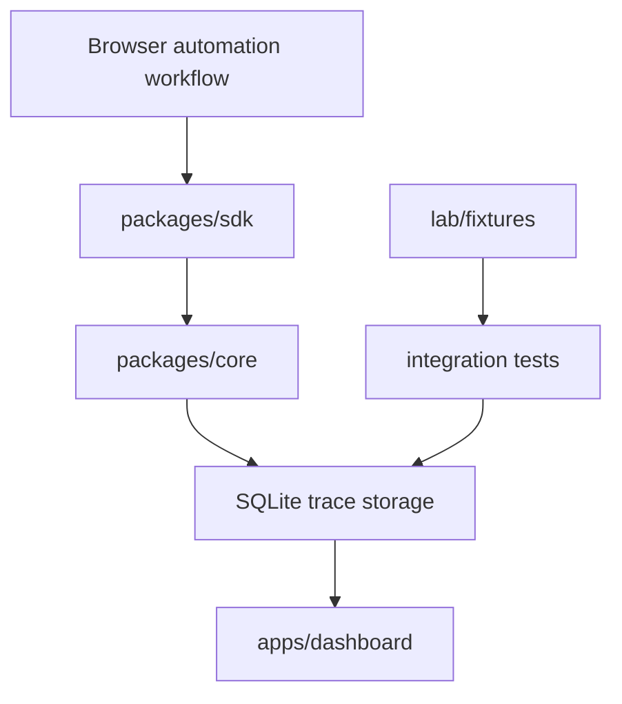

# RunLens Architecture

RunLens is split into a small public SDK, shared core primitives, local storage, examples, and a local dashboard.

## Boundaries

- The SDK observes runs and browser events without changing automation behavior.
- Adapters attach listeners and context providers; they do not spoof, bypass, or evade detection.
- Core owns stable event shapes, trace schema versions, storage contracts, and classification rules.
- The dashboard reads local trace data and presents timelines, failures, artifacts, and reliability signals.
- Examples use harmless local fixtures and write generated traces under `lab/test-runs`.
